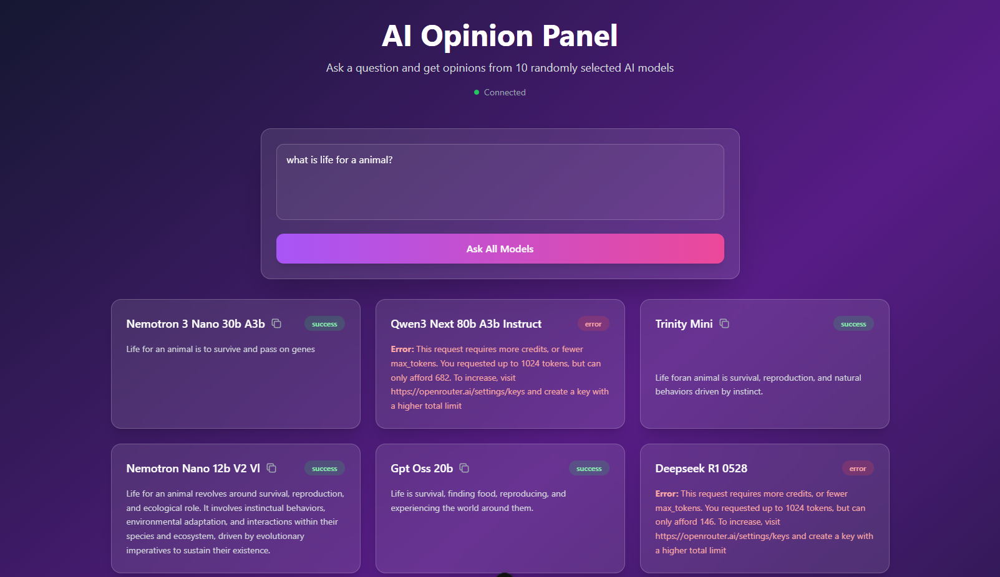

# AI Opinion

A real-time multi-LLM opinion aggregator built with Nuxt 4. This application allows users to ask a question and receive concurrent responses from up to 15 different AI models via the OpenRouter API.



## Features

- **Multi-Model Querying**: Automatically selects 15 random free models from OpenRouter to get diverse perspectives.
- **Real-Time Streaming**: Uses WebSockets to stream responses from models as soon as they arrive, without waiting for the slowest one.
- **Dynamic Model Fetching**: Periodically fetches and updates the list of available free models from OpenRouter.
- **Concise Responses**: Enforces a 140-character limit and plain text format for quick, digestible opinions.
- **User-Friendly UI**:
  - Clean, responsive card layout.
  - "Copy" button for easy text copying.
  - Submit (Enter) and Reset functionality.
  - Loading states and error handling.

## Tech Stack

- **Framework**: [Nuxt 4](https://nuxt.com/) (Vue.js)
- **Styling**: TailwindCSS
- **API Integration**: OpenRouter API
- **Real-Time Communication**: WebSockets (`ws` library)
- **Language**: TypeScript

## Setup

1.  **Clone the repository**

2.  **Install dependencies**

    ```bash
    pnpm install
    # or
    npm install
    ```

3.  **Configure Environment Variables**

    Create a `.env` file in the root directory and add your OpenRouter API key:

    ```env
    OPENROUTER_API_KEY=your_openrouter_api_key_here
    ```

## Development

Start the development server:

```bash
pnpm dev
# or
npm run dev
```

The application will be available at `http://localhost:3000`.

## Production

Build the application for production:

```bash
pnpm build
# or
npm run build
```

Preview the production build:

```bash
pnpm preview
# or
npm run preview
```

